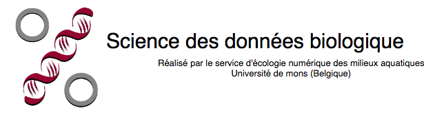

```{r setup, include=FALSE}
library(learnr)
knitr::opts_chunk$set(echo = FALSE)
# Load package 
#This does not seems to work?! SciViews::R()
library(data.io)
library(chart)
library(BioDataScience)
# Dataset
urchin <- read(file = "urchin_bio", package = "data.io", lang = "en")
```

## Objectifs

Ce tutoriel interactif a pour objectif d'apprendre à réaliser des graphiques de type nuage de points comme montré sur la figure ci-dessous.

```{r, fig.cap= "Variation de la masse du squelette en fonction de la masse totale de *Paracentrotus lividus* Lamarck 1816"}
chart(urchin, formula = skeleton ~ weight) +
  geom_point(na.rm = TRUE) +
  labs( y = "Masse du squelette [g]", x ="Masse totale [g]")
```

Il est important de préciser que l'ensemble de vos résultats est collecté afin de suivre votre progression. Ce test n'est cependant pas certificatif.

## Introduction

Le nuage de points permet de représenter une variable numérique en fonction d'une autre variable numérique. On peut exprimer cette relation dans R sous la forme de  $$y \sim x$$ que l'on peut lire : $$y \ en \ fonction \ de \ x$$


```{r, echo=FALSE, results= 'hide', message=FALSE, fig.cap= "Points essentiels d'un nuage de points"}
chart(urchin,formula = height ~  weight) + 
  geom_point() +
  labs( x = "Label de l'axe x  + [Unité]", 
        y = "Label de l'axe y + [Unité]") +
  theme(axis.text.x = element_text(colour = "#a80039", size = 15), 
        axis.title.x = element_text(colour = "#029687", size = 15), 
        axis.text.y = element_text(colour = "#a80039", size = 15), 
        axis.title.y = element_text(colour = "#029687", size = 15),
        axis.line.x = element_line(colour = "#a80039"),
        axis.line.y = element_line(colour = "#a80039"))
```


Les instructions de base afin de produire un nuage de points sont :

```{r, eval=FALSE}
# Importation du jeu de données
ub <- read("urchin_bio", package = "data.io")
# Réalisation du graphique 
chart(ub, formula = height ~ weight) +
  geom_point()
```

## Retour sur la vidéo

Commencez par réaliser rapidement les graphiques vus durant la capsule vidéo.

### Exercice 1

Le jeu de données `urchin_bio` portant sur la biométrie d'oursins est assigné à `urchin`. Les variables employées pour ce premier graphique sont la masse du squelette (`skeleton`) et le masse totale (`weight`).

```{r first_graph_intro}
chart(urchin, formula = skeleton ~ weight) +
  geom_point()
```

Réalisez un nuage de points montrant la masse du squelette en ordonnée et la masse totale en abscisse afin d'obtenir le graphique ci-dessus.

```{r first_graph, exercise=TRUE}
chart(DF, formula = YNUM ~ XNUM) +
  geom_point()
```

```{r first_graph-hint-1}
chart(urchin, formula = YNUM ~ XNUM) +
  geom_point()
```

```{r first_graph-hint-2}
chart(urchin, formula = skeleton ~ weight) +
  geom_point()
```

#### Exercice 2

Le jeu de données assigné à `urchin` contient des valeurs manquantes comme le précise le message suivant lors de la réalisation du graphique précédent.

**Warning message: Removed 163 rows containing missing values (geom_point).**

Ajoutez l'argument `na.rm = TRUE` dans la fonction `geom_point()` afin de préciser que les variables du jeu de données contiennent des valeurs manquantes. Réalisez un nuage de points montrant le masse du squelette en ordonnée et le masse totale en abscisse. Précisez qu'il y a des valeurs manquantes.

```{r na_graph, exercise=TRUE}
chart(DF, formula = YNUM ~ XNUM) +
  geom_point()
```

```{r na_graph-solution}
chart(urchin, formula = skeleton ~ weight) +
  geom_point(na.rm = TRUE)

#Dans la fonction `geom_point()`, il est possible d'employer l'argument `na.rm =` afin de préciser qu'il y a des valeurs manquantes (`na.rm = TRUE`). 
```

### Exercice 3

Vous souhaitez visualiser la différence d'origine des oursins mesurés. Ces informations se situent dans la variable sur l'origine (`origin`). L'utilisation de la couleur peut permettre de différencier ces derniers. La formule de la fonction `chart()` peut être complétée avec l'argument faisant référence à la couleur (`%col=%`). 

```{r col_graph_intro}
chart(urchin, formula = skeleton ~ weight %col=% origin) +
  geom_point(na.rm = TRUE)
```

Réalisez un nuage de points montrant la masse du squelette en ordonnée et la masse en abscisse. Utilisez la couleur afin de différencier l'origine des individus et précisez à nouveau qu'il y a des valeurs manquantes.

```{r col_graph, exercise=TRUE}
chart(DF, formula = YNUM ~ XNUM %col=% FACTOR) +
  geom_point()
```

```{r col_graph-solution}
chart(urchin, formula = skeleton ~ weight %col=% origin) +
  geom_point(na.rm = TRUE)
```


## Exercices sur le nuage de points  

Maintenant que vous avez rapidement réalisé les graphiques vus durant la vidéo, expérimentez d'autres fonctions et arguments liés au nuage de points.

### Exercice 1

La couleur n'est pas forcément l'argument le plus judicieux à employer pour différencier une variable facteur au sein d'un nuage de points. Il vous sera parfois demandé d'employer des formes (`%shape=%`) ou encore l'opacité (`%alpha=%`) que vous devez ajouter à la formule de la fonction `chart()`.

```{r alpha_graph_intro}
a <- chart(urchin, formula = lantern ~ test %alpha=% origin) +
  geom_point(na.rm = TRUE)

b <- chart(urchin, formula = lantern ~ test %shape=% origin) +
  geom_point(na.rm = TRUE)

ggpubr::ggarrange(a,b)
```

Nous pouvons observer que l'utilisation de la forme n'est pas forcément l'argument le plus judicieux dans cet exemple. 

Intéressez-vous à la masse de la lanterne d'aristote (`lantern`) en fonction de la masse du test (`test`). 

Réalisez un nuage de points montrant le masse de la lanterne d'Aristote (`lantern`) en ordonnée et la masse du test (`test`) en abscisse. Utilisez les nuances de gris afin de différencier l'origine des individus. Précisez à nouveau qu'il y a des valeurs manquantes.  


```{r alpha_graph, exercise=TRUE}
chart(DF, formula = YNUM ~ XNUM ) +
  geom_point()
```


```{r alpha_graph-hint-1}
chart(DF, formula = YNUM ~ XNUM %alpha=% FACTOR) +
  geom_point()
```


```{r alpha_graph-hint-2}
chart(urchin, formula = lantern ~ test %alpha=% origin) +
  geom_point(na.rm = TRUE)
```

### Exercice 2

Intéressez-vous maintenant à la masse (`weight`) des individus en fonction de leur masse immergée (`buoyant_weight`). 

Vous pouvez avoir le souhait d'employer 2 variables facteurs pour obtenir un graphique plus informatif. La variable portant sur le sex des individus (`sex`) peut être employée. 

```{r 2factor_graph_intro}
urchin <- dplyr::filter(urchin, sex != "NA")

chart(urchin, formula = weight ~ buoyant_weight %col=% origin %shape=% sex ) +
  geom_point(na.rm = TRUE)
```

Réalisez un nuage de points montrant la masse en ordonnée et la masse immergée en abscisse. Utilisez la couleur afin de différencier l'origine des individus et différentes formes afin de différencier le sex des individus. Précisez à nouveau qu'il y a des valeurs manquantes. 

Vous pouvez observer qu'une première ligne de code vous est fournies afin de retirer les lignes de tableau ne contenant pas l'information sur le sex des individus. Vous apprendrez dans les prochains cours à manipuler vos jeux de données.

```{r 2factor_graph, exercise=TRUE}
urchin <- dplyr::filter(urchin, sex != "NA")

chart(DF, formula = YNUM ~ XNUM) +
  geom_point()
```


```{r 2factor_graph-hint}
urchin <- dplyr::filter(urchin, sex != "NA")

chart(DF, formula = YNUM ~ XNUM %col=% FACTOR1 %shape=% FACTOR2) +
  geom_point()
```


```{r 2factor_graph-hint-2}
urchin <- dplyr::filter(urchin, sex != "NA")

chart(urchin, formula = weight ~ buoyant_weight %col=% origin %shape=% sex) +
  geom_point(na.rm = TRUE)
```

### Exercice 3

Intéressez-vous maintenant à la hauteur (`height`) en fonction de la masse (`weight`) des individus.

```{r}
a <- chart(urchin, formula = height ~ weight %col=% origin) +
  geom_point(na.rm = TRUE)
b <- chart(urchin, formula = log(height) ~ log(weight) %col=% origin) +
  geom_point(na.rm = TRUE)
ggpubr::ggarrange(a,b, common.legend = TRUE, legend = "right")
```


Réalisez un nuage de points montrant le logarithme de la masse en ordonnée et le logarithme de la masse immergée en abscisse. Utilisez la couleur afin de différencier l'origine des individus et précisez à nouveau qu'il y a des valeurs manquantes.

```{r log_log, exercise = TRUE}
chart(DF, formula = YNUM ~ XNUM) +
  geom_point()
```

```{r log_log-hint}
chart(urchin, formula = log(YNUM) ~ log(XNUM)) +
  geom_point()
```

```{r log_log-hint-1}
chart(urchin, formula = log(YNUM) ~ log(XNUM) %col=% FACTOR) +
  geom_point()
```

```{r log_log-hint-2}
chart(urchin, formula = log(height) ~ log(weight) %col=% origin) +
  geom_point(na.rm = TRUE)
```


## Challenge

Cette partie du learnr requiert d'appliquer les concepts vus précédement mais d'y ajouter de nouvelles que vous devez appréhender par vous-même via entre autres la section `Pour en savoir plus...` du livre. 

Employez le graphique que vous avez déjà réalisé précédement.

```{r challenge1_intro}
chart(urchin, formula = skeleton ~ weight) +
  geom_point(na.rm = TRUE)
```

Vous souhaitez changer le nom des axes pour rendre le graphique présentable en francais. 

Réalisez un nuage de points montrant la masse du squelette en ordonnée et la masse totale en abscisse et précisez qu'il y a des valeurs manquantes. De plus, changez le nom des variables `Weight of skeleton [g]` par `Masse du squelette [g]` et `Total weight [g]` par `Masse totale [g]`.

```{r challenge1, exercise = TRUE}

```

```{r challenge1-hint-1}
chart(urchin, formula = skeleton ~ weight) +
  geom_point(na.rm = TRUE) +
  labs(x = " ", y = " ") 
```

```{r challenge1-hint-2}
chart(urchin, formula = skeleton ~ weight) +
  geom_point(na.rm = TRUE) +
  labs(x = "Masse totale [g]", y = "Masse du squelette [g]") 
```

Employez le graphique que vous avez déjà réalisé précédement utilisant la couleur comme variable facteur différenciant les oursins mesurés en élevage et en milieu naturel. 

```{r}
chart(urchin, formula = skeleton ~ weight %col=% origin) +
  geom_point(na.rm = TRUE)
```


Vous souhaitez continuer la personalisation du graphique en changeant le nom des axes, le nom de la légende pour rendre le graphique présentable en francais. 


```{r challenge2_intro}
chart(urchin, formula = skeleton ~ weight %col=% origin) +
  geom_point(na.rm = TRUE) +
  labs( x = "Masse totale [g]", y = "Masse du squelette [g]")+
  scale_color_manual(values=c('#999999','#E69F00'), name = "Origine", labels = c("Elevage", "Milieu naturel"))
```

Réalisez un nuage de point montrant la masse du squelette en ordonnée et la masse en abscisse et précisez qu'il y a des valeurs manquantes. De plus, 
* changez le nom des variables `Weight of skeleton [g]` par `Masse du squelette [g]` et `Total weight [g]` par `Masse totale [g]`

* Changez le nom des légendes  `Origin` par `Origine`, `Farm` par `Elevage` et `Fishery` par `Milieu naturel`

* Changez les deux couleurs par les couleurs de votre choix. Nous avons employé du jaune et du gris pour notre part.


```{r challenge2, exercise = TRUE}

```

```{r challenge2-hint-1}
chart(urchin, formula = skeleton ~ weight %col=% origin) +
  geom_point(na.rm = TRUE) +
  labs( x = " ", y = " ")+
  scale_color_manual(values=c(" "," "), name = " ", labels = c(" ", " "))
```


```{r challenge2-hint-2}
chart(urchin, formula = skeleton ~ weight %col=% origin) +
  geom_point(na.rm = TRUE) +
  labs( x = "Masse totale [g]", y = "Masse du squelette [g]")+
  scale_color_manual(values=c('#999999','#E69F00'), name = "Origine", labels = c("Elevage", "Milieu naturel"))
```


## Conclusion

Bravo! Vous venez de terminez votre séance d'exercice dans un learnr. Ce dernier vous a proposé d'apprendre à employer le graphique de type nuage de point.


Laissez nous vos impressions sur cet outil pédagogique. Afin de placer un commentaire dans une zone de réponse utilisez la dièse (`#`) devant vos phrases.

```{r comm, exercise = TRUE}
# ajout de commentaires 
# 
```
