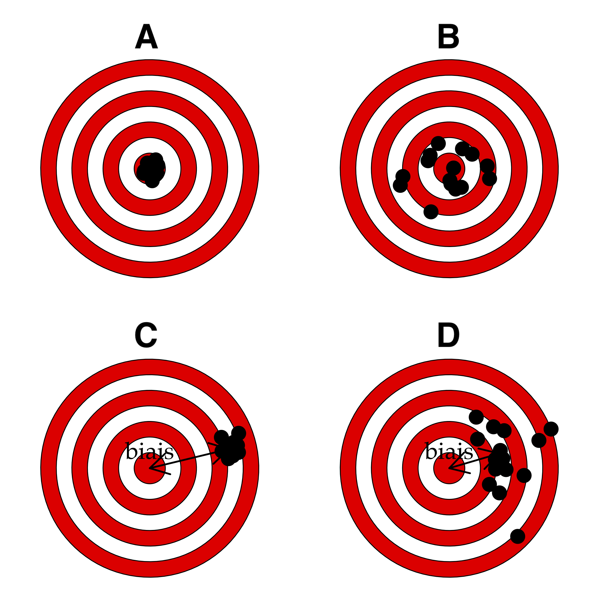

```{r setup, include=FALSE}
library(learnr)
library(knitr)
SciViews::R()

options(tutorial.event_recorder = BioDataScience::record_sdd)
tutorial_options(exercise.checker = BioDataScience::checker_sdd)
tutorial_options(exercise.timelimit = 60)
tutorial_options(exercise.cap = "Code R")
knitr::opts_chunk$set(echo = FALSE, comment = NA)

library(BioDataScience)
library(ggridges)

# Dataset
crabs <- read("crabs", package = "MASS", lang = "fr")
```

```{r, echo=FALSE}
fixedRow(
  column(9, div(
    img(src = 'images/BioDataScience-128.png', align = "left"),
    h1("Science des données biologiques"),
    "Réalisé par le service d'Écologie numérique des Milieux aquatiques, Université de Mons (Belgique)"
  )),
  column(3, div(
    textInput("user", "Utilisateur :", ""),
    textInput("email", "Email :", "")
  ))
)
textOutput("user") # This is newer shown, but required to trigger an event!
textOutput("email") # Idem!
```

```{r, context="server"}
output$user <- renderText({BioDataScience::user_name(input$user);""})
output$email <- renderText({BioDataScience::user_email(input$email);""})
updateTextInput(session, "user", value = BioDataScience::user_name())
updateTextInput(session, "email", value = BioDataScience::user_email())
```


## Préambule

Si vous n'avez jamais utilisé de tutoriel "learnr", familiarisez-vous d'abord avec son interface [ici](http://biodatascience-course.sciviews.org/sdd-umons/learnr.html).


> Conformément au RGPD ([Règlement Général sur la Protection des Données](https://ec.europa.eu/info/law/law-topic/data-protection/reform/rules-business-and-organisations/principles-gdpr_fr)), nous sommes tenus de vous informer de ce que vos résultats seront collectés afin de suivre votre progression. **Les données seront enregistrées au nom de l'utilisateur apparaissant en haut de cette page. Corrigez si nécessaire !** En utilisant ce tutoriel, vous marquez expressément votre accord pour que ces données puissent être collectées par vos enseignants et utilisées pour vous aider et vous évaluer. Après avoir été anonymisées, ces données pourront également servir à des études globales dans un cadre scientifique et/ou éducatif uniquement.


## Objectifs

- Comprendre les principaux tableaux de données utilisés en science des données
- Savoir réaliser des tableaux de contingences
- Acquérir des données et les encoder correctement et de manière à ce que les analyses soient reproductibles

## QCM 

Les questions suivantes sont sous la formes de QCM. Plusieurs réponses peuvent être correctes. 


```{r, include=TRUE, echo= FALSE}
bio <- data_frame(identifiant = c(1:4) , intensite_dans_etude = c("intensif", "faible", "moyen", "moyen"), age = c(18, 24, 20, 19), sexe = c("H", "H", "F", "H"))
kable(bio, col.names = c("Identifiant", "Travail", "Age", "Genre"), caption = "Quantité de travail fourni par des étudiants en fonction de leur age et genre. \\label{intensite_etude}")
```

Sur base des données ci-dessus, répondez aux questions suivantes 


```{r quiz}
quiz(caption = "Tableau de données",
  question("De quelle représentation s'agit-il ?",
           random_answer_order = TRUE,
           allow_retry = TRUE,
           incorrect = "Recommencez afin de trouver la bonne réponse",
           correct = "Bravo, c'est correct ",
           answer("Un tableau cas par variables", correct = TRUE),
           answer("Un tableau de contingence"),
           answer("Aucune des propositions n'est correcte")
           ),
  question("Quel est le type de la variable **sexe** ? ",
           random_answer_order = TRUE,
           allow_retry = TRUE,
           incorrect = "Recommencez afin de trouver la bonne réponse",
           correct = "Bravo, c'est correct ",
           answer("Quantitative continue"),
           answer("Quantitative discrète"),
           answer("Qualitative ordonnée"),
           answer("Qualitative non ordonnée", correct = TRUE)
           ),
  question("Quel est le type de la variable **age** ? ",
           random_answer_order = TRUE,
           allow_retry = TRUE,
           incorrect = "Recommencez afin de trouver la bonne réponse",
           correct = "Bravo, c'est correct ",
           answer("Quantitative continue", correct = TRUE),
           answer("Quantitative discrète"),
           answer("Qualitative ordonnée"),
           answer("Qualitative non ordonnée")
           ),
  question("Quel est le type de la variable **travail** ? ",
           random_answer_order = TRUE,
           allow_retry = TRUE,
           incorrect = "Recommencez afin de trouver la bonne réponse",
           correct = "Bravo, c'est correct ",
           answer("Quantitative continue"),
           answer("Quantitative discrète"),
           answer("Qualitative ordonnée", correct = TRUE),
           answer("qualitative non ordonnée")
           )
)
```


```{r, echo = TRUE}
(timolol <- tibble(
  traitement = c("timolol", "timolol", "placebo", "placebo"),
  patient    = c("sain",    "malade",  "sain",    "malade"),
  freq       = c(44,        116,       19,        128)
))

class(timolol)
```
Sur base des données ci-dessus, répondez aux questions suivantes :

```{r quiz1}
question("De quelle représentation s'agit-il ?",
           random_answer_order = TRUE,
           allow_retry = TRUE,
           incorrect = "Recommencez afin de trouver la bonne réponse",
           correct = "Bravo, c'est correct ",
           answer("Un tableau cas par variables"),
           answer("Un tableau de contingence"),
           answer("Aucune des propositions n'est correcte", correct = TRUE)
           )
```

{height='60%' width='60%'}

Sur base de l'image ci-dessus, répondez aux question suivantes :

```{r quiz2}
quiz(
  question("Qualifiez l'image A :", 
           type = "multiple",
           random_answer_order = TRUE,
           allow_retry = TRUE,
           incorrect = "Recommencez afin de trouver la/les bonne(s) réponse(s)",
           correct = "Bravo, c'est correct ",
           answer("Précis", correct = TRUE),
           answer("Imprécis"),
           answer("Exact", correct = TRUE),
           answer("Inexact")
           ),
  question("Qualifiez l'image B :", 
           type = "multiple",
           random_answer_order = TRUE,
           allow_retry = TRUE,
           incorrect = "Recommencez afin de trouver la/les bonne(s) réponse(s)",
           correct = "Bravo, c'est correct ",
           answer("Précis"),
           answer("Imprécis", correct = TRUE),
           answer("Exact", correct = TRUE),
           answer("Inexact")
           ),
  question("Qualifiez l'image C :", 
           type = "multiple",
           random_answer_order = TRUE,
           allow_retry = TRUE,
           incorrect = "Recommencez afin de trouver la/les bonne(s) réponse(s)",
           correct = "Bravo, c'est correct ",
           answer("Précis",  correct = TRUE),
           answer("Imprécis"),
           answer("Exact"),
           answer("Inexact", correct = TRUE)
           ),
  question("Qualifiez l'image D :", 
           type = "multiple",
           random_answer_order = TRUE,
           allow_retry = TRUE,
           incorrect = "Recommencez afin de trouver la/les bonne(s) réponse(s)",
           correct = "Bravo, c'est correct ",
           answer("Précis"),
           answer("Imprécis",  correct = TRUE),
           answer("Exact"),
           answer("Inexact", correct = TRUE)
           )
  )
```


## Conclusion

Bravo! Vous venez de terminer votre séance d'exercices dans un tutoriel "learnr". 

Laissez nous vos impressions sur cet outil pédagogique ou expérimentez encore dans la zone ci-dessous. Rappelez-vous que pour placer un commentaire dans une zone de code R, vous devez utilisez un dièse (`#`) devant vos phrases.

```{r comm, exercise=TRUE, exercise.lines = 8}
# Ajout de commentaires 
# ...
```

```{r comm-check}
# Not yet...
```

