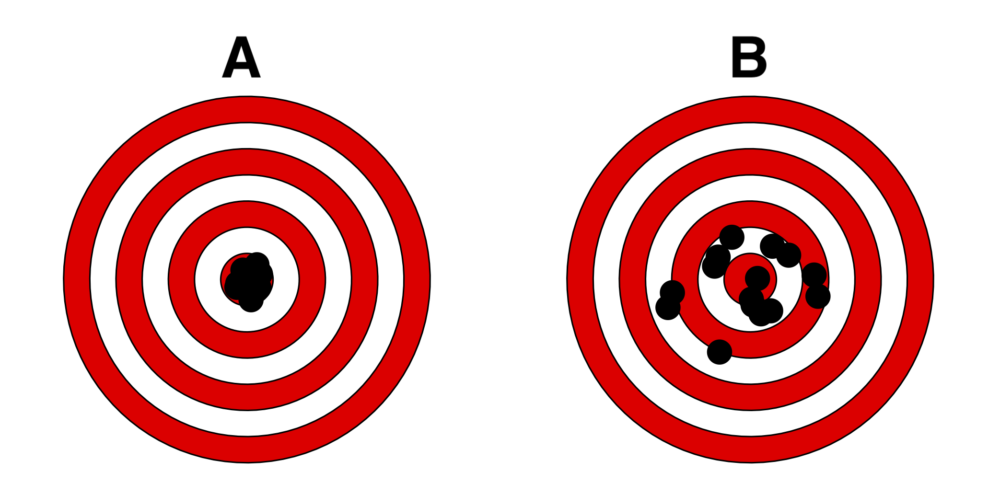

```{r setup, include=FALSE}
library(learnr)
library(knitr)
SciViews::R()

options(tutorial.event_recorder = BioDataScience::record_sdd)
tutorial_options(exercise.checker = BioDataScience::checker_sdd)
tutorial_options(exercise.timelimit = 60)
tutorial_options(exercise.cap = "Code R")
knitr::opts_chunk$set(echo = FALSE, comment = NA)

library(BioDataScience)
#dataset

```

```{r, echo=FALSE}
fixedRow(
  column(9, div(
    img(src = 'images/BioDataScience-128.png', align = "left"),
    h1("Science des données biologiques"),
    "Réalisé par le service d'Écologie numérique des Milieux aquatiques, Université de Mons (Belgique)"
  )),
  column(3, div(
    textInput("user", "Utilisateur :", ""),
    textInput("email", "Email :", "")
  ))
)
textOutput("user") # This is newer shown, but required to trigger an event!
textOutput("email") # Idem!
```

```{r, context="server"}
output$user <- renderText({BioDataScience::user_name(input$user);""})
output$email <- renderText({BioDataScience::user_email(input$email);""})
updateTextInput(session, "user", value = BioDataScience::user_name())
updateTextInput(session, "email", value = BioDataScience::user_email())
```

## Préambule

Lisez attentivement ces quelques instructions avant de vous lancer dans cet examen.

Durant l'ensemble du cours, vous avez été confronté à des learnr afin de vérifier l'acquisition de différents concepts lié à la science des données biologiques. Votre examen vous est proposé sous le même format. 

Ce questionnaire comprend 16 questions dont 15 questions à choix multiples avec la cotation suivantes :

- **bonne réponse  +1**
- **mauvaise réponse -1**

La question 16 est relative à la reproduction d'un graphique ne suit pas la règle du **+1/-1**

**Ne vous trompez pas dans votre adresse mail et votre identifiant Github**

**N'oubliez pas de soumettre votre réponse après chaque exercice**


> Conformément au RGPD ([Règlement Général sur la Protection des Données](https://ec.europa.eu/info/law/law-topic/data-protection/reform/rules-business-and-organisations/principles-gdpr_fr)), nous sommes tenus de vous informer de ce que vos résultats seront collecté afin de suivre votre progression. **Les données seront enregistrées au nom de l'utilisateur apparaissant en haut de cette page. Corrigez si nécessaire !** En utilisant ce tutoriel, vous marquez expressément votre accord pour que ces données puissent être collectées par vos enseignants et utilisées pour vous aider et vous évaluer. Après avoir été anonymisées, ces données pourront également servir à des études globales dans un cadre scientifique et/ou éducatif uniquement.

## 1. Calcul de probabilités sur tableau 

Sur base d'un questionnaire lié à l'indice de masse corporelle et l'activité physique, les chercheurs ont classé les individus en différents niveaux d'activité physique et d'IMC. Ils obtiennent le tableau suivant : 

```{r}
imc <- data.frame("Sous-poids" = sample(20:70, size = 3), 
                     "Normal" = sample(30:80, size = 3), 
                     "Surpoids" = sample(10:60, size = 3),
                     "Obésité" = sample(0:50, size = 3),
                     row.names = c("Activité physique occasionnelle", "Activité physique régulière", "Activité physique de haut niveau"))
knitr::kable(imc, caption = "Tableau")
```

Afin de vous aider dans vos réflexions, voici la somme des lignes et des colonnes

```{r, echo=TRUE}
# Somme des lignes
(rowSums(imc) -> x)
# Somme des colonnes
(colSums(imc) -> y)
# Somme totale d'observations
sum(x)
sum(y)
```

Vous avez à votre disposition une zone de code.

```{r proba_imc_cal, exercise = TRUE}

```

Répondez aux questions ci-dessous sur base du tableau proposé ci-dessus :

```{r qeq_proba_imc}
quiz(question("Quelle est la probabilité d'être en sous-poids ?",
              answer(sprintf("$%s$", 
                             round((sum(imc[ ,1])/sum(imc[1:3, ])), 4)), correct = TRUE),
              answer(sprintf("$%s$", 
                             round((sum(imc[ ,2])/sum(imc[1:3, ])), 4))),
              answer(sprintf("$%s$", 
                             round((sum(imc[3, ])/sum(imc[1:2, ])), 4))),
              answer(sprintf("$%s$", 
                             round((sum(imc[2, ])/sum(imc[1:2, ])), 4))),
              answer("Aucune réponse n'est correcte"),
              random_answer_order = TRUE),
     question("Quelle est la probabilité d'avoir une activité physique occasionnelle ou d'être en surpoids ?",
              answer(sprintf("$%s$", 
                             round((sum(imc[1, ]) + sum(imc[ ,3]) - imc[1,3]) / sum(imc[1:3, ]), 4)), 
                     correct = TRUE),
              answer(sprintf("$%s$", 
                             round((sum(imc[1, ]) + sum(imc[ ,3])) / sum(imc[1:3, ]), 4))),
              answer(sprintf("$%s$", 
                             round((sum(imc[2, ]) + sum(imc[ ,3]) - imc[2,4]) / sum(imc[1:3, ]), 4))),
              answer(sprintf("$%s$", 
                             round((sum(imc[1:3, ])/sum(imc[1:2, ])), 2))),
              answer("Aucune réponse n'est correcte"),
              random_answer_order = TRUE)
              )
```

## 2. Moyenne 

Calculez la moyenne, l'écart-type et le coefficient de variation du vecteur ci-dessous

```{r moyenne}
(x <- round(sample(20:30, size = 5) + rnorm(n = 5,mean = 0,sd = 1),2))
```

Vous avez à votre disposition une zone de code

```{r mean_cal, exercise = TRUE}

```

Répondez aux questions ci-dessous :

```{r qeq_moyenne}
quiz(question("Calculez la moyenne du vecteur ",
              answer(sprintf("$%s$", 
                             round(mean(x), 2)), correct = TRUE),
              answer(sprintf("$%s$", round(mean(x[-1]), 2))),
              answer(sprintf("$%s$", 
                             round(mean(x)-1, 2))),
              answer(sprintf("$%s$", 
                             round(x[3], 2))),
              answer("Aucune réponse n'est correcte"),
              random_answer_order = TRUE),
     question("Calculez l'écart-type du vecteur",
              answer(sprintf("$%s$", 
                             round(sd(x), 2)), correct = TRUE),
              answer(sprintf("$%s$", 
                             round(sd(x[-1]), 2))),
              answer(sprintf("$%s$", 
                             round(sd(x)-3,2))),
              answer(sprintf("$%s$", 
                             round(x[2], 2))),
              answer("Aucune réponse n'est correcte"),
              random_answer_order = TRUE),
     question("Calculez le coefficient de variation du vecteur en pourcent",
              answer(sprintf("$%s$", 
                             round(100*(sd(x)/mean(x)), 2)), correct = TRUE),
              answer(sprintf("$%s$", 
                             round(100*(sd(x[-1])/mean(x)), 2))),
              answer(sprintf("$%s$", 
                             round(100*(sd(x)-1)/mean(x)), 2)),
              answer(sprintf("$%s$", 
                             round(100*(x[2]/mean(x)), 2))),
              answer("Aucune réponse n'est correcte"),
              random_answer_order = TRUE)
     )
```

## 3. Analyse d'un histogramme 

Réalisez un histogramme sur base de la variable `x` du jeu de donnée `df1`.

**Des snippets sont mis à votre disposition en fin de question**

```{r, message= FALSE, warning= FALSE}
set.seed(1000)
data_frame( x = rnorm(500, 0, 3)) %>.%
  filter(., x > 0) -> df1
# chart(df1, formula = ~ x) +
#   geom_histogram()
```

```{r, echo = TRUE}
# nom du jeu de données : df1
# nom des colonnes
names(df1)
# résumé des données
summary(df1)
```

```{r histo_prepa}
set.seed(1000)
data_frame( x = rnorm(5000, 0, 1)) %>.%
  filter(., x > 0) -> df1
```

```{r histo_cal, exercise = TRUE, exercise.setup = "histo_prepa"}

```

Répondez à la question ci-dessous sur base du graphique ci-dessus:

```{r qeq_histo}
quiz(
  question("Définissez le mode de l'histogramme",
         answer("unimodal", correct = TRUE),
         answer("bimodal"),
         answer("multimodal"),
         random_answer_order = TRUE),
  question("Définissez la symétrie des sous-populations de l'histogramme",
         answer("symétrique"), 
         answer("asymétrique", correct = TRUE),
         random_answer_order = TRUE)
)
```

```{r, echo = TRUE, eval = FALSE}
## Charts ###############################################################################################
# ...charts
#..c

## Charts: Add ##########################################################################################
#..charts: add layers or annotations
#.ca

#.caplotly: convert last ggplot2 into interactive chart
plotly::ggplotly()

#.caylab: add or change Y label
${1:CHART} +
  ylab("${2:YOUR Y LABEL HERE}")

#.caxlab: add or change X label
${1:CHART} +
  xlab("${2:YOUR X LABEL HERE}")

#.catitle: add a plot title
${1:CHART} +
  ggtitle("${2:YOUR TITLE HERE}")

## Charts: Multivariate #################################################################################
# ..charts: multivariate
# .cm

#.cmcorr: correlation chart
corrplot::corrplot(cor(${1:DF}[, ${2:1:3}],
                       use = "pairwise.complete.obs"), method = "ellipse")

#.cmxy: multivariate X-Y scatterplot
GGally::ggscatmat(as.data.frame(${1:DF}), ${2:1:3})

## Charts: Bivariate ####################################################################################
snippet ..charts: bivariate
	.cb

#.cbhistfact: histogram by factor (facets)
chart(data = ${1:DF}, ~${2:XNUM} %fill=% ${3:XFACTOR} | ${3:XFACTOR}) +
  geom_histogram(data = select(${1:DF}, -${3:XFACTOR}), fill = "grey", bins = ${4:30}) +
  geom_histogram(bins = ${4:30}, show.legend = FALSE)

#.cberrbar2: error bars by two factors
chart(data = ${1:DF}, ${2:YNUM} ~ ${3:XFACTOR1} %col=% ${4:XFACTOR2}) +
  geom_jitter(alpha = 0.4, position = position_dodge(0.4)) +
  stat_summary(geom = "point", fun.y = "mean", position = position_dodge(0.4)) +
  stat_summary(geom = "errorbar", width = 0.1, position = position_dodge(0.4),
               fun.data = "mean_cl_normal", fun.args = list(conf.int = 0.95))

#.cberrbar: error bars by factor
chart(data = ${1:DF}, ${2:YNUM} ~ ${3:XFACTOR}) +
  geom_jitter(alpha = 0.4, width = 0.2) +
  stat_summary(geom = "point", fun.y = "mean") +
  stat_summary(geom = "errorbar", width = 0.1,
               fun.data = "mean_cl_normal", fun.args = list(conf.int = 0.95))

#.cbviolin: violinplot by factor
chart(data = ${1:DF}, ${2:YNUM} ~ ${3:XFACTOR}) +
  geom_violin()

#.cbbox: boxplot by factor
chart(data = ${1:DF}, ${2:YNUM} ~ ${3:XFACTOR}) +
  geom_boxplot()

#.cbxy: X-Y scatterplot
chart(data = ${1:DF}, ${2:YNUM} ~ ${3:XNUM}) +
  geom_point()

## Charts: Univariate ###################################################################################
# ..charts: univariate
#.cu

#.cuqqchisq: QQ plot - chi-square
car::qqPlot(${1:DF}[["${2:XNUM}"]], distribution = "chisq", df = ${3:DEGREES_OF_FREEDOM},
            envelope = 0.95, col = "Black", ylab = "${2:XNUM}")

#.cuqqf: QQ plot - F
car::qqPlot(${1:DF}[["${2:XNUM}"]], distribution = "f", df1 = ${3:NUMERATOR_DF}, df2 = ${4:DENOMINATOR_DF},
            envelope = 0.95, col = "Black", ylab = "${2:XNUM}")

#.cuqqt: QQ plot - Student t
car::qqPlot(${1:DF}[["${2:XNUM}"]], distribution = "t", df = ${3:DEGREES_OF_FREEDOM},
            envelope = 0.95, col = "Black", ylab = "${2:XNUM}")

#.cuqqnorm: QQ plot - normal
car::qqPlot(${1:DF}[["${2:XNUM}"]], distribution = "norm",
            envelope = 0.95, col = "Black", ylab = "${2:XNUM}")

#.cuhbar: horizontal bars
chart(data = ${1:DF}, ~factor(${2:VAR})) +
  geom_bar() + coord_flip()

#.cuvbar: vertical bars
chart(data = ${1:DF}, ~factor(${2:VAR})) +
  geom_bar()

#.cuhist: histogram
chart(data = ${1:DF}, ~${2:VARNUM}) +
  geom_histogram()
```

## 4. Boite de dispersion

```{r qeq_boxplot}
quiz(
  question("La boite de dispersion permet de résumer les données d'une variable numérique, quels sont les descripteurs employés ?",
           answer("la médiane", correct = TRUE),
           answer("la moyenne"),
           answer("l'espace inter-quartile", correct = TRUE),
           answer("la valeur maximale et la valeur minimale", correct = TRUE),
           answer("l'écart-type"),
           answer("l'intervalle de confiance"),
  random_answer_order = TRUE
))
```

## 5. Distribution de poisson

```{r}
.table <- data.frame(occurences = 0:(5+20), probability = dpois(0:(5+20), lambda = 5))
round(.table$probability,4) -> t
```

Calculez P($Y = 2$) d'une distribution de poisson avec une valeur de lambda de 5. 

**Des snippets sont mis à votre disposition en fin de question**

```{r poisson_cal, exercise = TRUE}

```

```{r qeq_poisson}
question("Calculez P($Y = 2$)",
         answer(sprintf("$%s$", t[1])),
         answer(sprintf("$%s$", t[2])),
         answer(sprintf("$%s$", t[3]), correct = TRUE),
         answer(sprintf("$%s$", t[4])),
         answer("aucune des réponses proposées"),
         random_answer_order = TRUE)
```

```{r, echo = TRUE, eval=FALSE}
## Distribution: poisson #########################################################################
# ..i (d)istribution: poisson
#.ip

# .ipcumul: poisson dist. - cumulative dens. plot
plot(0:(${1:MEAN_OCCURENCES}+20), dpois(0:(${1:MEAN_OCCURENCES}+20), lambda = ${1:MEAN_OCCURENCES}), type = "s",
     col = "black", xlab = "Quantiles", ylab = "Cumulative probability")

#.ipdens: poisson dist. - density plot
plot(0:(${1:MEAN_OCCURENCES}+20), dpois(0:(${1:MEAN_OCCURENCES}+20), lambda = ${1:MEAN_OCCURENCES}), type = "h",
     col = "black", xlab = "Quantiles", ylab = "Probability mass")

# .iptable: poisson dist. - table of probabilities
	(.table <- data.frame(occurences = 0:(${1:MEAN_OCCURENCES}+20), probability = dpois(0:(${2:MEAN_OCCURENCES}+20),
		lambda = ${2:MEAN_OCCURENCES})))

# .iprandom: poisson dist. - random
	rpois(${1:<N>}, lambda = ${2:MEAN_OCCURENCES})

# .ipquant: poisson dist. - quantiles
	qpois(${1:PROBABILITIES}, lambda = ${2:MEAN_OCCURENCES}, lower.tail = ${3:TRUE})

# .ipproba: poisson dist. - probabilities
	ppois(${1:QUANTILES}, lambda = ${2:MEAN_OCCURENCES}, lower.tail = ${3:TRUE})


## Distribution: binomial #########################################################################
# ..i (d)istribution: binomial
	.ib

# .ibcumul: binomial dist. - cumulative dens. plot
	plot(0:${1:N_TRIALS}, pbinom(0:${1:N_TRIALS}, size = ${1:N_TRIALS}, prob = ${2:SUCCESS_PROB), type = "s",
		col = "black", xlab = "Quantiles", ylab = "Cumulative probability")

#.ibdens: binomial dist. - density plot
	plot(0:${1:N_TRIALS}, dbinom(0:${1:N_TRIALS}, size = ${1:N_TRIALS}, prob = ${2:SUCCESS_PROB}), type = "h",
		col = "black", xlab = "Quantiles", ylab = "Probability mass")

# .ibtable: binomial dist. - table of probabilities
	(.table <- data.frame(success = 0:${1:N_TRIALS},
		probability = dbinom(0:${1:N_TRIALS}, size = ${1:N_TRIALS}, prob = ${2:SUCCESS_PROB})))

# .ibrandom: binomial dist. - random
	rbinom(${1:N}, size = ${2:N_TRIALS}, prob = ${3:SUCCESS_PROB})

# .ibquant: binomial dist. - quantiles
	qbinom(${1:PROBABILITIES}, size = ${2:N_TRIALS}, prob = ${3:SUCCESS_PROB}, lower.tail = ${4:TRUE})

# .ibproba: binomial dist. - probabilities
	pbinom(${1:QUANTILES}, size = ${2:N_TRIALS}, prob = ${3:SUCCESS_PROB}, lower.tail = ${4:TRUE})
```

## 6. Précision et exactitude

{height='60%' width='40%'}

```{r qeq_target}
quiz(question("Qualifiez l'image A ci-dessus :",
           random_answer_order = TRUE,
           answer("Précis", correct = TRUE),
           answer("Imprécis"),
           answer("Exact", correct = TRUE),
           answer("Inexact")
           ),
     question("Qualifiez l'image B ci-dessus :",
           random_answer_order = TRUE,
           answer("Précis"),
           answer("Imprécis", correct = TRUE),
           answer("Exact", correct = TRUE),
           answer("Inexact")))
     
```

## 7. Type de données

```{r, include=TRUE, echo= FALSE}
bio <- data_frame(identifiant = c(1:4) , intensite_dans_etude = c("intensif", "faible", "moyen", "moyen"), age = c(18, 24, 20, 19), genre = c("H", "H", "F", "H"))
kable(bio, col.names = c("Identifiant", "Travail", "Age", "Genre"))
```

Sur base des données ci-dessus, répondez aux questions suivantes 

```{r qeq_type}
quiz(
  question("Quel est le type de la variable **genre** ? ",
           random_answer_order = TRUE,
           answer("Quantitative continue"),
           answer("Quantitative discrète"),
           answer("Qualitative ordonnée"),
           answer("qualitative non ordonnée", correct = TRUE),
           answer("aucune des réponses proposées")),
  question("Quel est le type de la variable **travail** ? ",
           random_answer_order = TRUE,
           answer("Quantitative continue"),
           answer("Quantitative discrète"),
           answer("Qualitative ordonnée", correct = TRUE),
           answer("qualitative non ordonnée"),
           answer("aucune des réponses proposées")
           ),
  question("Quel est le type de la variable **identifiant** ?",
           random_answer_order = TRUE,
           answer("Quantitative continue"),
           answer("Quantitative discrète"),
           answer("Qualitative ordonnée"),
           answer("qualitative non ordonnée", correct = TRUE),
           answer("aucune des réponses proposées"))
)
```

## 8. Remaniement d'un tableau de données

```{r}
set.seed(43)
rep(c("A", "B", "C", "D", "E"), each = 20) -> t
tt <- c(rnorm(n = 20, mean = 10, sd = 1),
        rnorm(n = 20, mean = 12, sd = 1),
        rnorm(n = 20, mean = 11, sd = 1),
        rnorm(n = 20, mean = 12, sd = 1),
        rnorm(n = 20, mean = 14, sd = 1))
density <- data_frame(area = as.factor(t) , densi = tt)

density %>.%
  dplyr::filter(., area %in% c("A", "C", "E") & densi >= 12.9) %>.%
  nrow(.)-> t111
```

```{r, echo = TRUE}
#nom du jeu de données : density
names(density)
summary(density)
```

Vous devez retirer les zones (`area`) **B** et **D** et ne garder que les valeurs de densité supérieres ou égales à 12.9. 

**Des snippets sont mis à votre disposition en fin de question**

```{r rema_cal_prep}
set.seed(43)
rep(c("A", "B", "C", "D", "E"), each = 20) -> t
tt <- c(rnorm(n = 20, mean = 10, sd = 1),
        rnorm(n = 20, mean = 12, sd = 1),
        rnorm(n = 20, mean = 11, sd = 1),
        rnorm(n = 20, mean = 12, sd = 1),
        rnorm(n = 20, mean = 14, sd = 1))
density <- data_frame(area = as.factor(t) , densi = tt)
```

```{r rema_cal, exercise = TRUE, exercise.setup = "rema_cal_prep"}

```

```{r qeq_rema}
question("Combien y a t'il de ligne dans ce tableau réduit ?", 
         answer(sprintf("$%s$", t111), correct = TRUE),
         answer(sprintf("$%s$", t111 + 22)),
         answer(sprintf("$%s$", t111 + 3)),
         answer(sprintf("$%s$", t111+ 2)),
         answer(sprintf("$%s$", t111 + 52)),
         random_answer_order = TRUE)
```

```{r, echo = TRUE, eval=FALSE}
#.dosel select cases
DF %>.%
  filter(., CONDITIONS) -> DF2
DF %>.%
  select(., VAR1, VAR2) -> DF2
```

## 9. Calcul d'aire

```{r}
set.seed(43)
q <-  2.1 #round(rnorm(n = 1, mean = 2, sd = 0.2),2)
n <- 4 #sample(c(4,6,8), size = 1)
o <- 160 # sample()
```

Utilisez une distribution F afin de calculer l'aire à droite correspondant à un quantile de `r q` sur un échantillon de `r o` observations en `r n` groupes de tailles similaires.

**Des snippets sont mis à votre disposition en fin de question**

```{r aire_cal, exercise = TRUE}

```

```{r}
a1 <- round(pf(q, df1 = n - 1, df2 = o - n , lower.tail = FALSE), 4)
a2 <- round(pf(q, df1 = n - 1, df2 = o - n , lower.tail = TRUE), 4)
a3 <- round(pf(q, df1 = n, df2 = o, lower.tail = FALSE), 4)
a4 <- round(pf(2.1, df1 = n, df2 = o , lower.tail = TRUE), 4)
```

```{r qeq_aire}
question("Que veut l'aire à droite ? ",
         answer(sprintf("$%s$", a1), correct = TRUE),
         answer(sprintf("$%s$", a2)),
         answer(sprintf("$%s$", a3)),
         answer(sprintf("$%s$", a4)),
         answer("aucune des réponses proposées"),
         random_answer_order = TRUE)
```

```{r, echo = TRUE, eval = FALSE}
## Distribution: F ##############################################################################
#..i (d)istribution: F
#.if

#.ifrlabel: F dist. - add label to the right
	text(0.5, .d(0.5), .label, pos = 4, col = .col) # Label at right

#.ifllabel: F dist. - add label to the left
	text(1, .d(1), .label, pos = 2, col = .col) # Label at left

# .ifcumul: F dist. - cumulative dens. plot
	# Fisher-Snedecor's F distribution (cumulative probability) with parameter:
	.df1 <- ${1:NUMERATOR_DF}; .df2 <- ${2:DENOMINATOR_DF} # numerator (.df1) and denominator (.df2) df
	.col <- ${3:1}; .add <- ${4:FALSE} # Plot parameters
	.x <- seq(0, qf(0.999, df1 = .df1, df2 = .df2), l = 1000)  # Quantiles
	.d <- function (x) pf(x, df1 = .df1, df2 = .df2)           # Distribution function
	.q <- function (p) qf(p, df1 = .df1, df2 = .df2)           # Quantile for lower-tail prob
	.label <- bquote(F(.(.df1), .(.df2)));                     # Curve parameters
	curve(.d(x), xlim = range(.x), ylim = 0:1, xaxs = "i", n = 1000, col = .col,
		add = .add, xlab = "Quantiles", ylab = "Cumulative probability") # Curve
	abline(h = 0:1, col = "gray") # Baseline

# .ifdens: F dist. - density plot
	# Fisher-Snedecor's F distribution (density probability) with parameter:
	.df1 <- ${1:NUMERATOR_DF}; .df2 <- ${2:DENOMINATOR_DF} # numerator (.df1) and denominator (.df2) df
	.col <- ${3:1}; .add <- ${4:FALSE} # Plot parameters
	.x <- seq(0, qf(0.999, df1 = .df1, df2 = .df2), l = 1000)  # Quantiles
	.d <- function (x) df(x, df1 = .df1, df2 = .df2)           # Distribution function
	.q <- function (p) qf(p, df1 = .df1, df2 = .df2)           # Quantile for lower-tail prob
	.label <- bquote(F(.(.df1), .(.df2)))                      # Curve parameters
	curve(.d(x), xlim = range(.x), xaxs = "i", n = 1000, col = .col,
		add = .add, xlab = "Quantiles", ylab = "Probability density") # Curve
	abline(h = 0, col = "gray") # Baseline

# .ifrandom: F dist. - random
	rf(${1:N}, df1 = ${2:NUMERATOR_DF}, df2 = ${3:DENOMINATOR_DF})

# _ifquant: F dist. - quantiles
	qf(${1:PROBABILITIES}, df1 = ${2:NUMERATOR_DF}, df2 = ${3:DENOMINATOR_DF}, lower.tail = ${4:TRUE})

# .ifproba: F dist. - probabilities
	pf(${1:QUANTILES}, df1 = ${2:NUMERATOR_DF}, df2 = ${3:DENOMINATOR_DF}, lower.tail = ${4:TRUE})

```


## 10. Le nombre de degrés de liberté

```{r}
sang <- data.frame(groupe = c("A", "B", "AB", "O", "A", "B", "AB", "O", "A", "B", "AB", "O"),
                   etat = c("Floride", "Floride", "Floride", "Floride", "Iowa", "Iowa", "Iowa", "Iowa", "Missouri", "Missouri", "Missouri", "Missouri"),
                   freq = c(122, 117, 19, 244, 1781, 1351, 289, 3301, 353, 269, 60, 713))

sang_table <- xtabs(freq ~ groupe + etat, data = sang)
knitr::kable(sang_table)
```

Les chercheurs souhaitent réaliser un test de $\chi^2$ d'indépendance. Ils souhaitent cependant déterminer le nombre de degré de liberte de votre $\chi^2$ de cette analyse.

```{r qeq_quiz}
question("Sur base du tableau de données ci-dessus, déterminez le nombre de degré de liberté de la distribution du $\\chi^2$ correspondante ",
         answer("1"),
         answer("2"),
         answer("3"),
         answer("4"), 
         answer("6", correct = TRUE),
         answer("12"))
```

## 11. Conditions d'application

```{r qeq_wilcoxon}
quiz(question("Sélectionnez les conditions d'application d'un test de Wilcoxon ?",
  answer("échantillon représentatif (par exemple, aléatoire)", correct = TRUE),
  answer("observations indépendantes", correct = TRUE),
  answer("variable dite réponse quantitative", correct = TRUE),
  answer("variable dite explicative qualitative à trois niveaux ou plus"),
  answer("les distributions au sein des différentes sous-population sont, si possible, similaires mais de forme quelconque", 
         correct = TRUE),
  answer("distribution normale des résidus"),
  answer("homoscédasticité"),
  answer("distribution de la population normale ou approximativement normale"),
  answer("une variable facteur dite explicative à deux niveaux", correct = TRUE),
  random_answer_order = TRUE
),
question("Lors d'un test bilatéral de Wilcoxon, Y a t'il rejet de $H_0$ au seuil $\\alpha$ de 5% pour une valeur de 0.051 ",
         answer("oui"),
         answer("non", correct = TRUE)))
```

## 12. Normalité d'une variable

```{r}
set.seed(43)
df <- data_frame(x = rnorm(n = 80, mean = 10, sd = 1),
                 y = x^5)
# car::qqPlot(df[["x"]], distribution = "norm",
#   envelope = 0.95, col = "Black", ylab = "x")
```

```{r, echo = TRUE}
#nom du jeu de données : df
names(df)
summary(df)
```

Sur base du jeu de données suivant ci-dessus , répondez à la question ci-dessous

**Des snippets sont mis à votre disposition en fin de question**

```{r norm_cal_prepa}
set.seed(43)
df <- data_frame(x = rnorm(n = 80, mean = 10, sd = 1),
                 y = x^5)
```


```{r norm_cal, exercise = TRUE, exercise.setup = "norm_cal_prepa"}

```


```{r qeq_normalite}
question("Est ce que la variable x du jeu de donnée df suit une ... ",
         answer("distribution normale"),
         answer("distribution approximativement normale", correct = TRUE),
         answer("distribution anormale"),
         random_answer_order = TRUE)
```


```{r, echo = TRUE, eval = FALSE}
## Charts ###############################################################################################
# ...charts
# ..c


## Charts: Add ##########################################################################################
# ..charts: add layers or annotations
# .ca

# .caplotly: convert last ggplot2 into interactive chart
	plotly::ggplotly()

# .caylab: add or change Y label
	${1:CHART} +
		ylab("${2:YOUR Y LABEL HERE}")

# .caxlab: add or change X label
	${1:CHART} +
		xlab("${2:YOUR X LABEL HERE}")

# .catitle: add a plot title
	${1:CHART} +
		ggtitle("${2:YOUR TITLE HERE}")


## Charts: Multivariate #################################################################################
# ..charts: multivariate
# .cm

# .cmcorr: correlation chart
corrplot::corrplot(cor(${1:DF}[, ${2:1:3}], 
                       use = "pairwise.complete.obs"), method = "ellipse")

# .cmxy: multivariate X-Y scatterplot
	GGally::ggscatmat(as.data.frame(${1:DF}), ${2:1:3})


## Charts: Bivariate ####################################################################################
# ..charts: bivariate
# .cb

#.cbhistfact: histogram by factor (facets)
chart(data = ${1:DF}, ~${2:XNUM} %fill=% ${3:XFACTOR} | ${3:XFACTOR}) +
	  geom_histogram(data = select(${1:DF}, -${3:XFACTOR}), fill = "grey", bins = ${4:30}) +
	  geom_histogram(bins = ${4:30}, show.legend = FALSE)

# .cberrbar2: error bars by two factors
chart(data = ${1:DF}, ${2:YNUM} ~ ${3:XFACTOR1} %col=% ${4:XFACTOR2}) +
  geom_jitter(alpha = 0.4, position = position_dodge(0.4)) +
  stat_summary(geom = "point", fun.y = "mean", position = position_dodge(0.4)) +
  stat_summary(geom = "errorbar", width = 0.1, position = position_dodge(0.4),
               fun.data = "mean_cl_normal", fun.args = list(conf.int = 0.95))

#.cberrbar: error bars by factor
chart(data = ${1:DF}, ${2:YNUM} ~ ${3:XFACTOR}) +
  geom_jitter(alpha = 0.4, width = 0.2) +
  stat_summary(geom = "point", fun.y = "mean") +
  stat_summary(geom = "errorbar", width = 0.1,
               fun.data = "mean_cl_normal", fun.args = list(conf.int = 0.95))

# .cbviolin: violinplot by factor
	chart(data = ${1:DF}, ${2:YNUM} ~ ${3:XFACTOR}) +
		geom_violin()

# .cbbox: boxplot by factor
	chart(data = ${1:DF}, ${2:YNUM} ~ ${3:XFACTOR}) +
		geom_boxplot()

# .cbxy: X-Y scatterplot
	chart(data = ${1:DF}, ${2:YNUM} ~ ${3:XNUM}) +
		geom_point()
	
## Charts: Univariate ###################################################################################
# ..charts: univariate
#.cu

#.cuqqchisq: QQ plot - chi-square
car::qqPlot(${1:DF}[["${2:XNUM}"]], distribution = "chisq", df = ${3:DEGREES_OF_FREEDOM},
            envelope = 0.95, col = "Black", ylab = "${2:XNUM}")

#.cuqqf: QQ plot - F
car::qqPlot(${1:DF}[["${2:XNUM}"]], distribution = "f", df1 = ${3:NUMERATOR_DF}, df2 = ${4:DENOMINATOR_DF},
            envelope = 0.95, col = "Black", ylab = "${2:XNUM}")

#.cuqqt: QQ plot - Student t
car::qqPlot(${1:DF}[["${2:XNUM}"]], distribution = "t", df = ${3:DEGREES_OF_FREEDOM},
            envelope = 0.95, col = "Black", ylab = "${2:XNUM}")

#.cuqqnorm: QQ plot - normal
car::qqPlot(${1:DF}[["${2:XNUM}"]], distribution = "norm",
            envelope = 0.95, col = "Black", ylab = "${2:XNUM}")

#.cuhbar: horizontal bars
chart(data = ${1:DF}, ~factor(${2:VAR})) +
  geom_bar() + coord_flip()

#.cuvbar: vertical bars
chart(data = ${1:DF}, ~factor(${2:VAR})) +
  geom_bar()

#.cuhist: histogram
chart(data = ${1:DF}, ~${2:VARNUM}) +
  geom_histogram(binwidth = ${3:30})
```


## 13. Calcul de quantiles et de probabilités

```{r}
# moyenne 
m <- sample(x = 120:140, size = 1)
# écart-type
s <- sample(x = 20:30, size = 1)
# valeur d'intérêt
q <- sample(x = 140:150, size = 1)
# valeur d'intérêt 2
y <- sample(x = 130:140, size = 1)
# valeur d'intérêt 3
y1 <- sample(x = 110:120, size = 1)
```

Dans un champs de maïs (Considérez le nombre de plant de mais comme très grand), dont la taille moyenne est de `r m`  cm et d'écart type de `r s` cm. 

**Des snippets  sont mis à votre disposition en fin de question**

```{r dnorm_cal, exercise = TRUE}

```

```{r}
# Q1
q1 <- pnorm(q, mean = m, sd = s, lower.tail = FALSE)
q2 <- pnorm(q - 10, mean = m, sd = m-s, lower.tail = TRUE)
q3 <- pnorm(q, mean = m, sd = s, lower.tail = TRUE)
q4 <- pnorm(q - 20, mean = m, sd = s, lower.tail = FALSE)
# p1
p1 <- pnorm(y, mean = m, sd = s, 
            lower.tail = TRUE) - pnorm(y1, mean = m, sd = s, 
                                       lower.tail = TRUE)
p2 <- pnorm(y - 5, mean = m, sd = s, 
            lower.tail = TRUE) - pnorm(y1, mean = m-s, sd = s, 
                                       lower.tail = TRUE)
p3 <- pnorm(y, mean = q, sd = q, 
            lower.tail = TRUE) - pnorm(y1 +20, mean = m, sd = s/2,
                                       lower.tail = TRUE)
p4 <- pnorm(y, mean = m, sd = s, 
            lower.tail = TRUE) - pnorm(y1, mean = q, sd = s, 
                                       lower.tail = TRUE)
```

```{r qeq_dnorm}
quiz(question(
  sprintf("Quelle est la probabilité d'obtenir une plante de plus de $%s$ cm ?", q), 
  answer(sprintf("$%s$", round(q1, 4)),correct = TRUE),
  answer(sprintf("$%s$", round(q2, 4))),
  answer(sprintf("$%s$", round(q3, 4))),
  answer(sprintf("$%s$", round(q4, 4))),
  answer("Aucune des réponses proposées"),
  random_answer_order = TRUE
  ),
question(
  sprintf("Quelle est la probabilité d'obtenir une plante dont la taille est comprise entre $%s$ et $%s$ cm ?", y, y1), 
  answer(sprintf("$%s$", round(p1, 4)),correct = TRUE),
  answer(sprintf("$%s$", round(p2, 4))),
  answer(sprintf("$%s$", round(p3, 4))),
  answer(sprintf("$%s$", round(p4, 4))),
  answer("Aucune des réponses proposées"),
  random_answer_order = TRUE
  )
)
```

```{r,echo = TRUE, eval = FALSE}
### .iu : distribution uniforme 
punif(QUANTILES, min = 0, max = 1, lower.tail = TRUE)
qunif(PROBABILITIES, min = 0, max = 1, lower.tail = TRUE)

### .in distribution normale
pnorm(QUANTILES, mean = 0, sd = 1, lower.tail = TRUE)
qnorm(PROBABILITIES, mean = 0, sd = 1, lower.tail = TRUE)

### .il distribution log-normal
plnorm(QUANTILES, meanlog = 0, sdlog = 1, lower.tail = TRUE)
qlnorm(PROBABILITIES, meanlog = 0, sdlog = 1, lower.tail = TRUE)

### .it distribution de student
.mu <- 0; .s <- 1; pt((QUANTILES - .mu)/.s, df = DEGREES_OF_FREEDOM, lower.tail = TRUE)
.mu <- 0; .s <- 1; .mu + .s * qt(PROBABILITIES, df = DEGREES_OF_FREEDOM, lower.tail = TRUE)

### .ib distribution binomial
pbinom(QUANTILES, size = N_TRIALS, prob = SUCCESS_PROB, lower.tail = TRUE)
qbinom(PROBABILITIES, size = N_TRIALS, prob = SUCCESS_PROB, lower.tail = TRUE)

### .ip distribution de poisson
ppois(QUANTILES, lambda = MEAN_OCCURENCES, lower.tail = TRUE)
qpois(PROBABILITIES, lambda = MEAN_OCCURENCES, lower.tail = TRUE)

### .ic distribution chi2
pchisq(QUANTILES, df = DEGREES_OF_FREEDOM, lower.tail = TRUE)
qchisq(PROBABILITIES, df = DEGREES_OF_FREEDOM, lower.tail = TRUE)

### .if distibution de F
pf(QUANTILES, df1 = NUMERATOR_DF, df2 = DENOMINATOR_DF, lower.tail = TRUE)
```


## 14. Test de comparaisons multiples

```{r}
set.seed(43)
y <- c(rnorm(n = 40, mean = 20, sd = 5),
       rnorm(n = 40, mean = 21, sd = 5),
       rnorm(n = 40, mean = 22, sd = 5))
group <- rep(c("A", "B", "C"), each = 40)

df <- data_frame(y = y, group = as.factor(group))

# anova(anova. <- lm(data = df, y ~ group))
# 
# summary(anovaComp. <- confint(multcomp::glht(anova.,
#   linfct = multcomp::mcp(group = "Tukey")))) # Add a second factor if you want
# .oma <- par(oma = c(0, 5.1, 0, 0)); plot(anovaComp.); par(.oma); rm(.oma)
```

```{r, echo = TRUE}
# nom du jeu de données df
names(df)
summary(df)
anova(anova. <- lm(data = df, y ~ group))
```

Suite à l'analyse des résultats ci-dessus, réalisez un test de comparaison multiple de Tukey. 

**Des snippets  sont mis à votre disposition en fin de question**

```{r resi_prepa}
set.seed(43)
y <- c(rnorm(n = 40, mean = 20, sd = 5),
       rnorm(n = 40, mean = 21, sd = 5),
       rnorm(n = 40, mean = 22, sd = 5))
group <- rep(c("A", "B", "C"), each = 40)

df <- data_frame(y = y, group = as.factor(group))
anova(anova. <- lm(data = df, y ~ group))
```

```{r tukey, exercise = TRUE, exercise.setup = "resi_prepa"}

```

```{r qeq_tukey}
quiz(
  question("Est-il nécessaire de réaliser une test de comparaisons multiples de Tukey ? ",
         answer("oui"),
         answer("non", correct = TRUE)),
  question("Quelles sont les combinaisons de variables significativements différentes au seuil alpha de 0.05", 
         answer("B - A"),
         answer("C - A"),
         answer("C - B"),
         answer("aucune des propositions", correct = TRUE)))
```

```{r, echo = TRUE, eval = FALSE}
# ..hypothesis tests: means
#.hm

# .hmanovamult: anova - multiple comparisons [multcomp]
summary(anovaComp. <- confint(multcomp::glht(anova.,
  linfct = multcomp::mcp(${1:XFACTOR} = "Tukey")))) # Add a second factor if you want
.oma <- par(oma = c(0, 5.1, 0, 0)); plot(anovaComp.); par(.oma); rm(.oma)

# .hmanovaresid: anova - residuals
residuals(anova.)

# .hmanovaqqplot: anova - residuals QQ-plot
# plot(anova., which = 2)
anova. %>.%
  chart(broom::augment(.), aes(sample = .std.resid)) +
  geom_qq() +
  #geom_qq_line(colour = "darkgray") +
  labs(x = "Theoretical quantiles", y = "Standardized residuals") +
  ggtitle("Normal Q-Q")

# .hmanova2nested: two-way ANOVA (nested model)
anova(anova. <- lm(data = ${1:DF}, ${2:YNUM} ~ ${3:XFACTOR} + ${4:BLOCK} %in% ${3:XFACTOR}))

# .hmanova2noint: two-way ANOVA (without interactions)
anova(anova. <- lm(data = ${1:DF}, ${2:YNUM} ~ ${3:XFACTOR1} + ${4:XFACTOR2}))

# .hmanova2: two-way ANOVA (complete model)
anova(anova. <- lm(data = ${1:DF}, ${2:YNUM} ~ ${3:XFACTOR1} * ${4:XFACTOR2}))

# .hmanova2desc: two-way ANOVA (description)
${1:DF} %>.%
  group_by(., ${2:XFACTOR1}, ${3:XFACTOR2}) %>.%
  summarise(., mean = mean(${4:YNUM}), sd = sd(${4:YNUM}), count = sum(!is.na(${4:YNUM})))

# .hmanova1: one-way ANOVA
anova(anova. <- lm(data = ${1:DF}, ${2:YNUM} ~ ${3:XFACTOR}))

# .hmanova1desc: one-way ANOVA (description)
${1:DF} %>.%
  group_by(., ${2:XFACTOR}) %>.%
  summarise(., mean = mean(${3:YNUM}), sd = sd(${3:YNUM}), count = sum(!is.na(${3:YNUM})))

# .hmttestindep: independent Student's t-test
	t.test(data = ${1:DF}, ${2:YNUM} ~ ${3:XFACTOR},
		alternative = "two.sided", conf.level = 0.95, var.equal = TRUE)

# .hmttestpaired: paired Student's t-test
t.test(${1:DF}\$XNUM, ${1:DF}\$YNUM,
       alternative = "two.sided", conf.level = 0.95, paired = TRUE)

# .hmttestuni: univariate Student's t-test
t.test(${1:DF}\$2:XNUM,
       alternative = "two.sided", mu = 0, conf.level = 0.95)
```

## 15. Choix d'un test statistique

```{r qeq_bartlet}
quiz(question("Sélectionnez les tests statistiques qui permettent de vérifier l'homogénéité des variances",
         answer("Test de Bartlett", correct = TRUE),
         answer("Test de Shapiro-wilk"),
         answer("Test de Friedman"),
         answer("Test de Pearson"),
         answer("Aucune des réponses proposées"),
         random_answer_order = TRUE),
     question("Y a t'il homoscédasticité avec une valeur de p de 0.0003 au seuil $\\alpha$ de 0.05",
              answer("Oui"),
              answer("Non", correct = TRUE),
         random_answer_order = TRUE))
```

## 16. Reproduction d'un graphique  

Reproduisez le graphique suivant

```{r}
set.seed(43)
df <- data_frame(x = 1:300 + rnorm(n = 300, mean = 10, sd = 5), 
                   y = x + rnorm(n = 300, mean = 10, sd = 5),
                   zone = as.factor(rep(c("A", "B"), times = 150)),
                   area = as.factor(rep(1:3, times = 100))
                   )
df[(nrow(df)-20):(nrow(df)), 2] <- NA
```

```{r}
chart(df, y ~ x%col=% area | zone) +
  geom_point(na.rm = TRUE)
```

avec le jeu de donnée df

```{r, echo = TRUE}
# nom du jeu de données df
# names
names(df)
summary(df)
```

**Des snippets sont mis à votre disposition en fin de question**

```{r reprod_prepa}
set.seed(43)
df <- data_frame(x = 1:300 + rnorm(n = 300, mean = 10, sd = 5), 
                   y = x + rnorm(n = 300, mean = 10, sd = 5),
                   zone = as.factor(rep(c("A", "B"), times = 150)),
                   area = as.factor(rep(1:3, times = 100))
                   )
df[(nrow(df)-20):(nrow(df)), 2] <- NA
```

```{r qec_reprod, exercise = TRUE, exercise.setup = "reprod_prepa"}

```

```{r qec_reprod-check}
#TODO
```

Vous avez à votre disposition les snippets suivants

```{r, echo = TRUE, eval = FALSE}
## Charts ###############################################################################################
# ...charts
# ..c


## Charts: Add ##########################################################################################
# ..charts: add layers or annotations
# .ca

# .caplotly: convert last ggplot2 into interactive chart
	plotly::ggplotly()

# .caylab: add or change Y label
	${1:CHART} +
		ylab("${2:YOUR Y LABEL HERE}")

# .caxlab: add or change X label
	${1:CHART} +
		xlab("${2:YOUR X LABEL HERE}")

# .catitle: add a plot title
	${1:CHART} +
		ggtitle("${2:YOUR TITLE HERE}")


## Charts: Multivariate #################################################################################
# ..charts: multivariate
# .cm

# .cmcorr: correlation chart
corrplot::corrplot(cor(${1:DF}[, ${2:1:3}], 
                       use = "pairwise.complete.obs"), method = "ellipse")

# .cmxy: multivariate X-Y scatterplot
	GGally::ggscatmat(as.data.frame(${1:DF}), ${2:1:3})


## Charts: Bivariate ####################################################################################
# ..charts: bivariate
# .cb

#.cbhistfact: histogram by factor (facets)
chart(data = ${1:DF}, ~${2:XNUM} %fill=% ${3:XFACTOR} | ${3:XFACTOR}) +
	  geom_histogram(data = select(${1:DF}, -${3:XFACTOR}), fill = "grey", bins = ${4:30}) +
	  geom_histogram(bins = ${4:30}, show.legend = FALSE)

# .cberrbar2: error bars by two factors
chart(data = ${1:DF}, ${2:YNUM} ~ ${3:XFACTOR1} %col=% ${4:XFACTOR2}) +
  geom_jitter(alpha = 0.4, position = position_dodge(0.4)) +
  stat_summary(geom = "point", fun.y = "mean", position = position_dodge(0.4)) +
  stat_summary(geom = "errorbar", width = 0.1, position = position_dodge(0.4),
               fun.data = "mean_cl_normal", fun.args = list(conf.int = 0.95))

#.cberrbar: error bars by factor
chart(data = ${1:DF}, ${2:YNUM} ~ ${3:XFACTOR}) +
  geom_jitter(alpha = 0.4, width = 0.2) +
  stat_summary(geom = "point", fun.y = "mean") +
  stat_summary(geom = "errorbar", width = 0.1,
               fun.data = "mean_cl_normal", fun.args = list(conf.int = 0.95))

# .cbviolin: violinplot by factor
	chart(data = ${1:DF}, ${2:YNUM} ~ ${3:XFACTOR}) +
		geom_violin()

# .cbbox: boxplot by factor
	chart(data = ${1:DF}, ${2:YNUM} ~ ${3:XFACTOR}) +
		geom_boxplot()

# .cbxy: X-Y scatterplot
	chart(data = ${1:DF}, ${2:YNUM} ~ ${3:XNUM}) +
		geom_point()
```


## Conclusion

Vous venez de terminer votre examen.

Laissez nous vos impressions sur cet outil pédagogique ou expérimentez encore dans la zone ci-dessous. Rappelez-vous que pour placer un commentaire dans une zone de code R, vous devez utilisez un dièse (`#`) devant vos phrases.

```{r comm, exercise=TRUE, exercise.lines = 8}
# Ajout de commentaires 
# ...
```

```{r comm-check}
# Not yet...
```